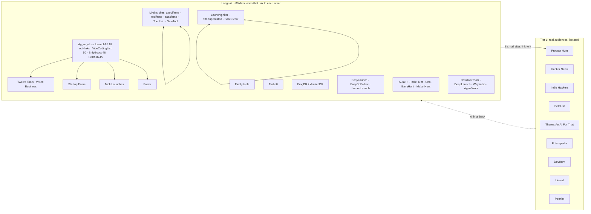

# How launch platforms relate to each other

_Snapshot 2026-10-06. Method: open each platform's homepage logged out, collect every link that points to another platform in the registry (badges, footers, "partners", "resources", "featured on" strips). 105 platforms, 980 links. Raw graph: [`data/link-graph.json`](../data/link-graph.json). 中文洞察报告：[insights/2026-10-launch-platform-ecosystem.zh-CN.md](../insights/2026-10-launch-platform-ecosystem.zh-CN.md)._

This is the **link network**, not measured visitor traffic. Real referral volumes need Similarweb / Ahrefs; the traffic numbers below are what platforms say about themselves.

## The short version

There are two worlds with almost no links between them.

1. **Tier 1 (Product Hunt, Hacker News, Indie Hackers, BetaList, There's An AI For That, Futurepedia, DevHunt, Uneed, Peerlist) link to none of the long tail**, and the long tail barely links to them: Product Hunt gets 8 links from small sites, Uneed 1, Peerlist 1, BetaList / Indie Hackers / TAAFT / DevHunt 0. These are separate audiences; plan them as separate launches.
2. **The long tail is a backlink exchange mesh.** Most small directories require your badge on your homepage, and they put each other's badges on *their* homepages. So most links in the mesh point at platform homepages, not at product pages, and most of their value is SEO / Domain Rating, not visitors.
3. **The people browsing the long tail are mostly other makers.** "Upvote 3 launches to unlock your free launch" (ShipBoost, StackLedge, StartupBase, KittyLaunch, Launch List, Maidensail, Launch Llama…) means founders visit each other's listings. Good audience if you sell to founders; thin if you sell to anyone else.

## Hubs: most linked-to in the mesh

| Platform | Linked from N platforms | Note |
|---|---|---|
| Twelve Tools | 34 | Same maker as Wired Business (29), Ramen Tools, 500.Tools; their badges sit on dozens of directories |
| Startup Fame | 30 | |
| Wired Business | 29 | |
| Findly.tools | 27 | Also sells "submit to 100+ directories" |
| Nick Launches | 24 | **Most mutual links (10 pairs)** — the social hub of indie launch sites |
| Turbo0 | 24 | Mkdirs software vendor's own directory |
| Fazier | 20 | Claims DR 83+ |
| saasfame / toolfame | 19 / 16 | Mkdirs family, link to each other and to aitoolfame |
| Dofollow.Tools | 17 | Sister sites DeepLaunch, Wayfindio, AgentWork |
| FrogDR | 16 | Not a launch site: the DR checker whose badge many directories show |
| Aura++, Good AI Tools, Uno Directory | 14 each | Aura++ runs a partner ring (EarlyHunt, IndieHunt, MakerHunt, SideHunt, Uno) |

**Aggregators** (link out to most of the mesh): LaunchAF (87 platforms), VibeCodingList (50), ShipBoost (48, its "Featured on" strip), ListBulb (45), Wonderlaunch (36). Being listed there puts you one click from everything else, but they send backlinks more than buyers.

## Clusters (same owner or same software, cross-linked)

- **Twelve Tools · Wired Business · Ramen Tools · 500.Tools**: one maker; instant listing after badge verification.
- **Mkdirs**: Turbo0, aitoolfame, toolfame, saasfame, ToolRain, NewTool.site, aihuntlist, DodoDirectory; mutual links among the *fame* sites.
- **LaunchIgniter network**: LaunchIgniter ↔ StartupTrusted ↔ SaaSGrow (all mutual), plus AppPage, MacIgniter; the schedule page cross-sells the other two.
- **Squeeze**: EasyLaunch ↔ EasyDoFollow ↔ LemonLaunch.
- **get-started template**: Good AI Tools, We Like Tools, Unite List, Trustiner, Acid Tools, ShinyLaunch, Startup Benchmarks.
- **Dofollow.Tools family**: Dofollow.Tools, DeepLaunch, Wayfindio, AgentWork.Tools (shared daily free quota pattern).
- **Aura++ ring**: Aura++, EarlyHunt, IndieHunt, MakerHunt, SideHunt, Uno Directory.
- **Indie hub ring**: Nick Launches ↔ OpenHunts, SaaSCity, ScrollLaunch, StartupTrusted, SaaSGrow, Launch Llama, VibeCodingList, Commune, DanielLaunches, Aura++ (mutual); LaunchIt ↔ LaunchAF, Launch Llama, Wonderlaunch, VibeCodingList, Founder.best.

## What platforms say about their own reach (unverified)

| Platform | Self-reported |
|---|---|
| Submit Hunt | 1–2M (homepage claim) |
| Whatsthebigdata | 1M+ monthly visitors, 50K+ subscribers |
| SaaSCity | 521K visitors / 30 days, 14K Google impressions / day, DR 65 |
| aitoolfame | 223,847 monthly visitors (Cloudflare) |
| Launch Llama | 154K+ active users, 65K+ newsletter, DA 73 |
| ProductWatch | 100K+ monthly visits, DR 72 |
| AI Directories | 65K monthly visitors, 3.25M impressions, DR 70 |
| LaunchIgniter | DR 75 dofollow (paid) |
| TinyShelf | DR 74 |
| Maidensail | DR 65 |
| LetsLaunch | DR 49 |

## What this means for a launch plan

1. **Treat Tier 1 as the real launch.** Product Hunt / Hacker News / Indie Hackers / BetaList (and TAAFT / Futurepedia for AI tools) bring audiences the mesh never reaches. Each needs its own prepared launch day; don't expect the mesh to feed them.
2. **Treat the mesh as SEO and AI-search infrastructure.** 40–60 listings + dofollow links lift Domain Rating (which unlocks the DR-gated free tiers), create pages that search engines and AI assistants find. Automate it (this repo); don't spend founder hours on it.
3. **Prioritise hubs and high-DR sites inside the mesh**: Twelve Tools / Wired Business, Nick Launches, Fazier, Turbo0, Startup Fame, Findly, SaaSCity, ProductWatch, LaunchIgniter, StartupBase. Then the aggregators (LaunchAF, ShipBoost, VibeCodingList) for reach across the rest.
4. **Expect founders as the audience.** The upvote-to-unlock loop means visitors are mostly other makers; great for B2B tools for founders and marketers, weak for consumer apps.
5. **Your homepage joins the mesh.** Free tiers want their badge on your homepage; 30–40 badges is normal. Keep them in one server-rendered block (a scrolling strip works), and re-verify after redesigns — removal gets you delisted.
6. **Re-check twice a year.** Small directories appear and disappear fast (two of ours went 404 within weeks). Regenerate this graph with the crawl in `data/link-graph.json`'s method note before planning a new launch.
